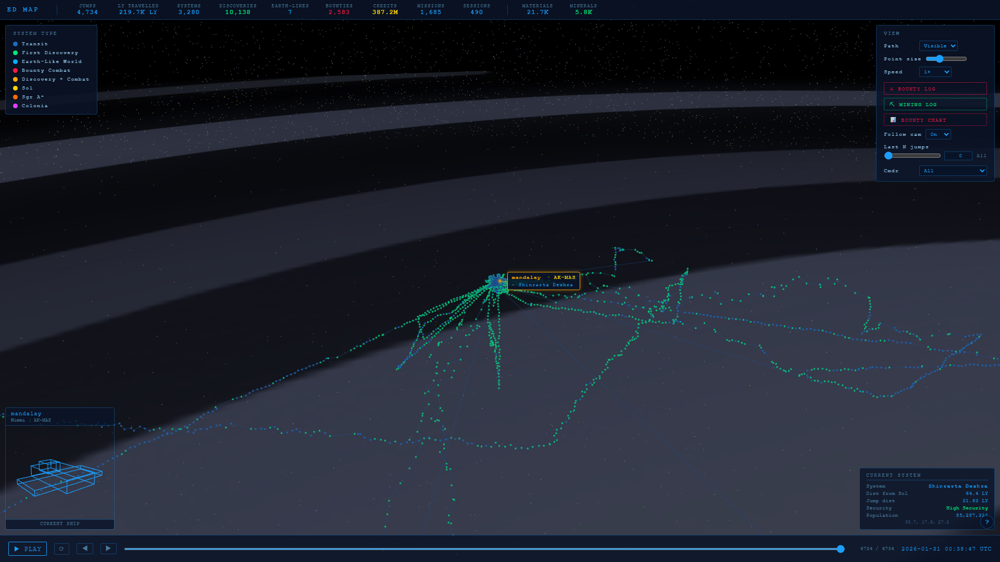

# Elite Dangerous Galaxy Map

[](LICENSE)
[](#)
[](#)

A self-hosted 3D galaxy map for Elite Dangerous, driven by your local journal
logs. Drop `.log` files into `JournalLogs/`, watch them flow into PostgreSQL,
then scrub through your history in a Three.js 3D view.



```
JournalLogs/Journal*.log
        │
        ▼  (watcher polls every 30s)
   PostgreSQL  ◄─── ETL one-shot loads
        │
        ▼
   FastAPI /api/*
        │
        ▼
   http://localhost:8051   — Three.js map
```

## Quickstart

Requires Docker + Docker Compose v2.

```bash
# 1. Configure credentials (copy and edit)
cd ed-map
cp .env.example .env

# 2. Bring up Postgres, the watcher, and the map
docker compose up -d

# 3. Bulk-load every existing log once
docker compose run --rm elite-etl

# 4. Open the map
#    http://localhost:8051
```

Drop new `Journal*.log` files into `JournalLogs/`. The watcher picks them
up within `POLL_INTERVAL` seconds (default 30), loads them, refreshes the
materialised view, and moves the file to `JournalLogs/Loaded/`.

## Common operations

```bash
# Run the parser test suite
docker compose --profile test run --rm elite-tests

# Reload everything from scratch (drops + recreates schema)
docker compose run --rm elite-etl --rebuild

# Tail the watcher logs
docker compose logs -f elite-watcher

# Health probe (returns JSON with DB + matview status)
curl http://localhost:8051/api/health
```

## Layout

```
.
├── JournalLogs/              ← drop .log files here
│   └── Loaded/               ← watcher moves processed files here
├── archive/                  ← legacy SQLite-era code and backups
└── ed-map/                   ← the application
    ├── docker-compose.yml
    ├── etl.py                # parsers + bulk insert
    ├── watcher.py            # long-running incremental loader
    ├── map_api.py            # FastAPI server
    ├── schema.sql            # tables + indexes + jump_aggregates matview
    ├── map.html
    ├── static/               # CSS + vendored Three.js + ES modules
    └── tests/                # pytest parser tests
```

## Keyboard shortcuts (on the map)

| Key | Action |
|---|---|
| W / A / S / D | Pan target on the galactic plane |
| Q / E | Pan up / down |
| F | Toggle follow camera |
| B | Toggle Bounty Log |
| M | Toggle Mining Log |
| X | Toggle Bounty Chart |
| Space | Play / Pause |
| 0 | Restart timeline |
| 1 – 6 | Speed: 0.25× / 0.5× / 1× / 5× / 20× / 100× |
| ? | Open the on-screen cheatsheet |

## Docs

- `ed-map/docs/EliteGalaxyMap-UserGuide.docx` — end-user walkthrough.
- `ed-map/docs/EliteGalaxyMap-TechnicalReference.docx` — architecture,
  data model, ETL design, materialised-view strategy, front-end module
  graph, operational guidance.

Both can be rebuilt from `ed-map/tools/build_*.py`.
